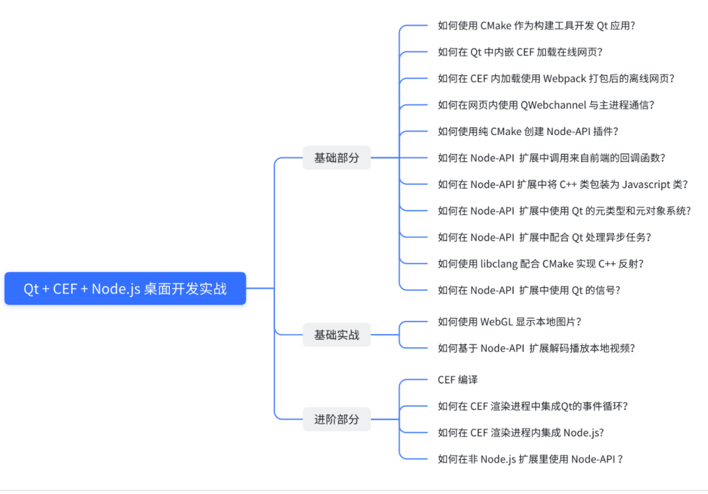

# QCefNode
本仓库是稀土掘金课程 [
Qt + CEF + Node.js 桌面开发实战](https://juejin.cn/book/7195542456308334630) 的配套代码仓库。

QCefNode 是集成了完整 Node.js 运行时的 CEF 发行版，理论上 Node.js 的以下特性 QCefNode 都兼容：
1. Node.js 的所有内置模块。
2. 基于 Node-API 的 `.node` 扩展（需要修改 lazy load hook 将 node.exe 重定向至 libcef.dll）。
3. 基于 Node-API 的内嵌扩展（使用 process._linkedBinding 加载）。

QCefNode 还提供了在渲染进程内嵌入其他事件循环（例如 Qt）的接口，这使得基于 Node-API 向前端内暴露一些 GUI 相关的接口成为可能，另外，此接口还使得在 Node-API 扩展内可以使用 Qt 的信号与槽，从而简化 Node-API 扩展的开发。

QCefNode 100% 兼容 CEF 的原始接口，原有的项目可以无缝迁移。

目前 QCefNode 仅测试了 CEF origin/4896 + Chromium 100.0.4896.88 + Node.js v16.13.2，其他版本还在规划中。

预编译文件请转至 [Releases](https://github.com/kohillyang/qcefnode-juejin-course/releases) 页面。
## 课程的详细目录



## 用法举例
在没有 Node.js 以及 Node-API 时，原始的 CEF 向前端暴露一个函数的写法如下：
```cpp
class MyV8Handler : public CefV8Handler {
  public:
    MyV8Handler() {}

    virtual bool Execute(const CefString &name,
                         CefRefPtr<CefV8Value> object,
                         const CefV8ValueList &arguments,
                         CefRefPtr<CefV8Value> &retval,
                         CefString &exception) override {
        if (name == "sayHello") {
            retval = CefV8Value::CreateString("hello world!");
            return true;
        }
        return false;
    }
    IMPLEMENT_REFCOUNTING(MyV8Handler);
};
class ClientAppRenderer : public CefApp, public CefRenderProcessHandler {
    void OnContextCreated(CefRefPtr<CefBrowser> browser,
                          CefRefPtr<CefFrame> frame,
                          CefRefPtr<CefV8Context> context) override {
        context->Enter();
        CefRefPtr<CefV8Handler> handler = new MyV8Handler();

        CefRefPtr<CefV8Value> func = CefV8Value::CreateFunction("sayHello", handler);
        context->GetGlobal()->SetValue("sayHello", func,
                                       CefV8Value::PropertyAttribute::V8_PROPERTY_ATTRIBUTE_NONE);
        context->Exit();
    }
    CefRefPtr<CefRenderProcessHandler> GetRenderProcessHandler() { return this; }

  public:
    ClientAppRenderer() = default;

  private:
    IMPLEMENT_REFCOUNTING(ClientAppRenderer);
    DISALLOW_COPY_AND_ASSIGN(ClientAppRenderer);
};
```

有了 Node.js，可以使用 Node-API 配合 [node-addon-api](https://github.com/nodejs/node-addon-api) 向前端暴露函数，其写法要比 CEF 原来的写法清晰很多，功能也更强大：

```cpp
class ClientAppRenderer : public CefApp, public CefRenderProcessHandler {
    void OnContextCreated(CefRefPtr<CefBrowser> browser,
                          CefRefPtr<CefFrame> frame,
                          CefRefPtr<CefV8Context> context) override {
        if (!frame->IsMain()) {
            return;
        }
        if (QString::fromStdString(frame->GetURL().ToString()).contains("devtools")) {
            return;
        }
        context->Enter();
        napi_env env_;
        napi_status status = napi_create_env(&env_, __FILE__);
        if (status != napi_status::napi_ok) {
            std::abort();
        }
        Napi::Env env(env_);
        env.Global().Set("sayHello", Napi::Function::New(env, [](Napi::CallbackInfo &cb) {
                             return Napi::String::New(cb.Env(), "hello world");
                         }));
        context->Exit();
    }
    CefRefPtr<CefRenderProcessHandler> GetRenderProcessHandler() { return this; }

  public:
    ClientAppRenderer() = default;

  private:
    IMPLEMENT_REFCOUNTING(ClientAppRenderer);
    DISALLOW_COPY_AND_ASSIGN(ClientAppRenderer);
};
```

CEFNodeQt 允许用户加载 Node-API 扩展，以下是在 CEF 内使用 Node-API 调用 libavcodec 解码视频的效果图：


CEFNodeQt 允许用户使用 process._linkedBinding 加载内嵌扩展，例如下图中被加载的扩展暴露了一个字符串 "hello world"：


## 如何编译课程章节配套代码
`1`. 安装 Visual Studio 2019。

`2`. 从[Releases](https://github.com/kohillyang/qcefnode/releases) 下载预编译好的 CEF 并解压到源代码根目录下的 cef 文件夹内。

`3`. 下载并安装 [OpenCV 4.5.4](https://opencv.org/releases/) 到源代码根目录下的文件夹 opencv4.5.4 中。

`4`. 安装 Qt 5.12.10，确保已勾上 qwebengine。

`5`. 确保源代码的目录结构如下图所示：


`6`. 在源代码根目录执行以下命令：
```
# 注意需要修改 qt5dir 至你的Qt安装目录
# 编译结果在文件夹 build 中寻找
.\Python3.7.9\python.exe .\build.py --qt5dir=Qt5.12.10/5.12.10/msvc2017_64/lib/cmake/Qt5 
```

## 如何编译 QCefNode
请转至稀土掘金课程 [
Qt + CEF + Node.js 桌面开发实战](https://juejin.cn/book/7195542456308334630)。